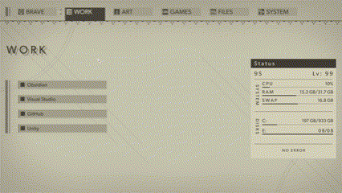

# Cass Adefuin's User Page

```

system.out.println("Hello World!");

```
## Table of Contents
1. [Introduction](#introduction)
2. [Programming Life](#programming-life)
3. [Personal Life](#personal-life)

## Introduction
Salutations, prospective coworkers and perusing strangers!
- Name: Cass Adefuin
- Pronouns: They/Them
- Major: Computer Science
- Minor: Cognitive Science

<sup> double CS hehe </sup>

## Programming Life
I aspire to be a UI designer and front-end developer, although I am also capable in back-end and management.
### Languages
- C
- C++
- Java
### Skills
- Detail Oriented
- Organized
- I don't cram last minute :\)
### Education
B.S. Computer Science, University of California San Diego

September 2023 - Exp. June 2027

Relevant Courses:
- Data Structures
- Design & Analysis of Algorithms
- Software Tools & Techniques
- Computer Organization
- Operating System Principles
- Discrete Mathematics
- Linear Algebra
### Experience
UI Programming Team Lead for *Mariposa*, Video Game Development Club @ UCSD

January 2025 - Present

- Organized tasks and priorities according to time restraints 
- Facilitated communication between UI programming and design teams

UI Designer for *[Athenaeum](https://ethancreek.itch.io/athenaeum)*, Video Game Development Club @ UCSD

January 2024 - December 2024

- Collaborated across multiple teams to determine interface requirements
- Redesigned interfaces according to playtesting feedback
- Reduced asset file sizes by 50% by designing tileable interfaces

Our itch.io release is quite dated; we've improved the game since then. Our progress is as follows:
- [x] create Minimum Viable Product
- [x] create Minimum Marketable product
- [ ] publish on steam

View the complete portfolio [here](vgdc.md).

## Personal Life

### Languages
- English
- Filipino
- Spanish
- Japanese
### Interests
- Digital Artist freelancer
- various forms of arts
  - illustrations
  - graphic design
  - singing
  - food presentation
  - piano
  - many, *many,* more
- anime
and of course...

### Video Games
My favorite video games have inspired other interests, namely:
- *Minecraft* was the birthplace of my love for programming, since I liked making minigames with command blocks.
- *Hollow Knight* was an unforgettable experience (I'm looking at you, *Path of Pain*) and inspiration for some UI designs.
- *NieR: Automata* inspired my interest in philosophy and UI design. Their menus were so appealing, I customized my desktop to look like it.
<picture>  </picture>

> "A future is not given to you. It is something you must take for yourself"
> \- Pod 042, *NieR: Automata*
